## Evidencias del Laboratorio Desarrollado

### Integrante: Haro Vargas Gabriel
1.- Crear Proyecto
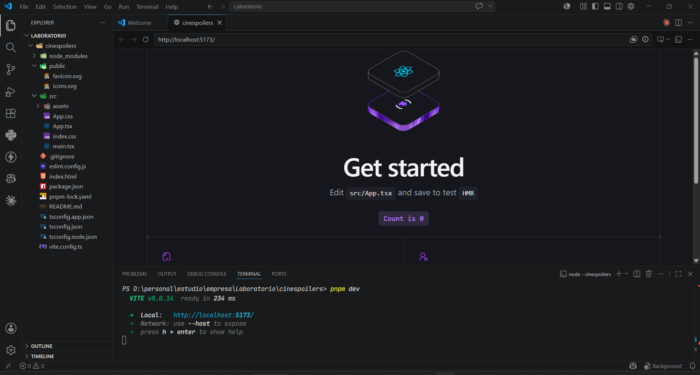

2.- Limpiar Proyecto
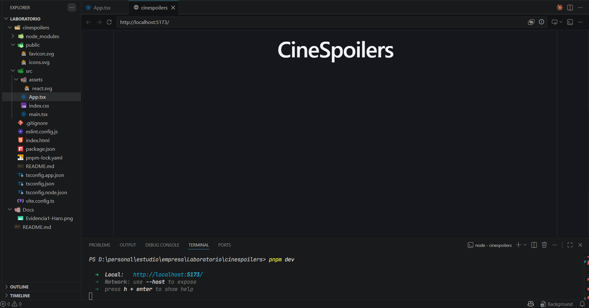

3.- Instalar Tailwind
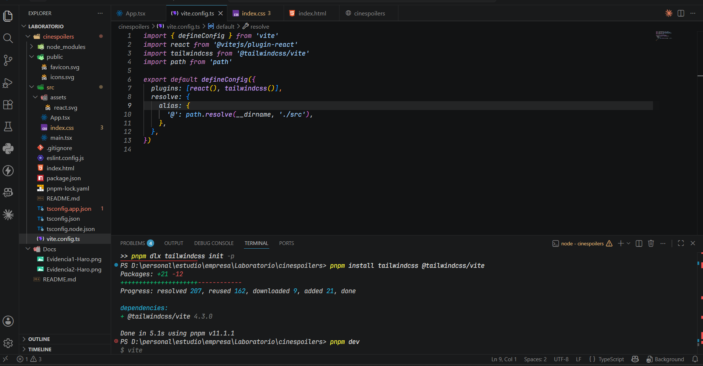

4.- Configurar Alias
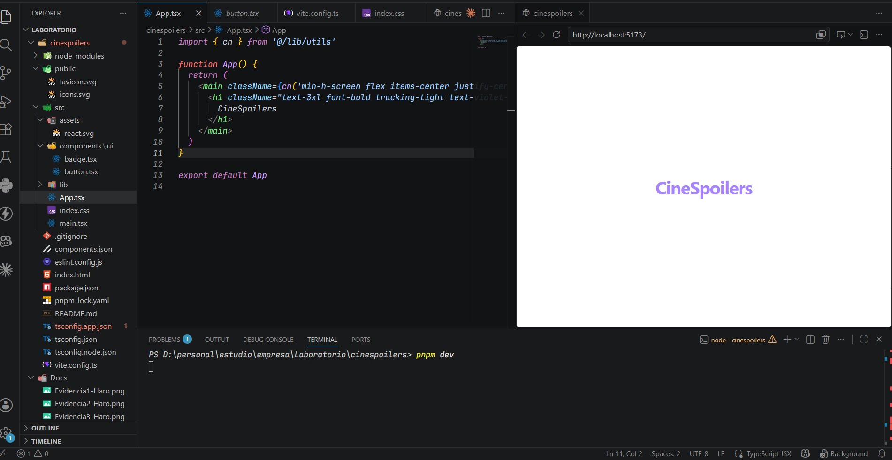

5.- Configurar e Instalar Shadcn
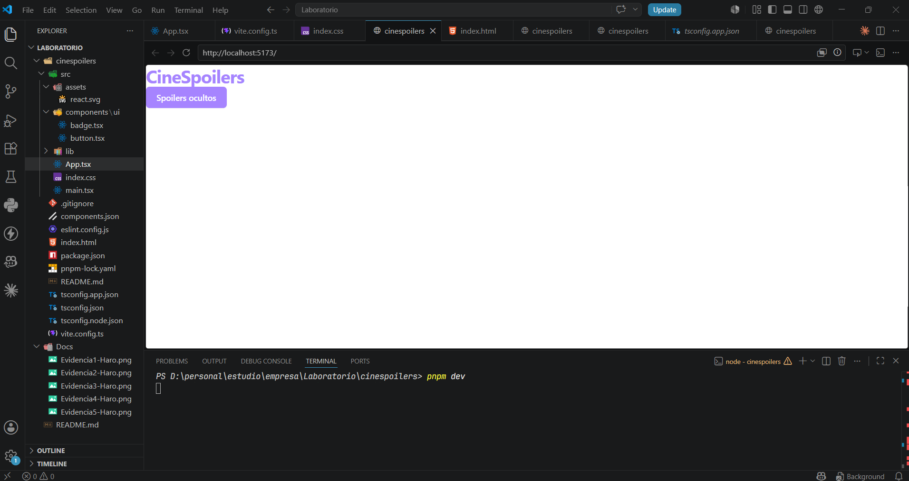

6.- Instalar y configurar axios
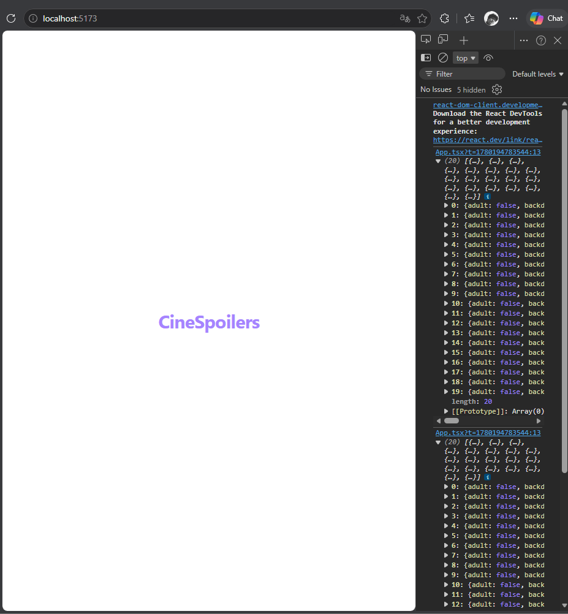

7.- Renderizado de información
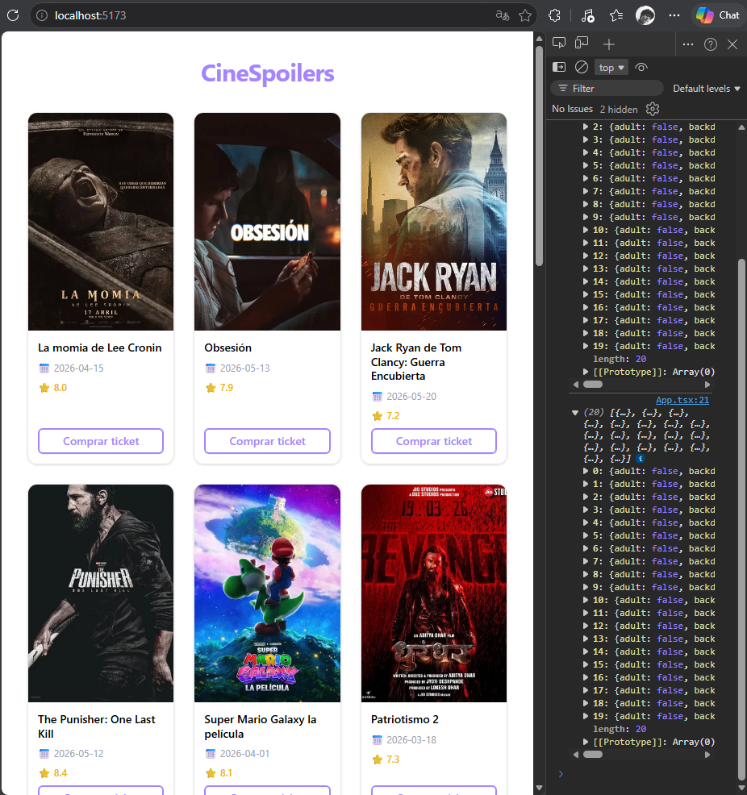

### Integrante: Olano Paniora Oscar

### Integrante: Quintana Llanque Rony

1.- Crear Proyecto
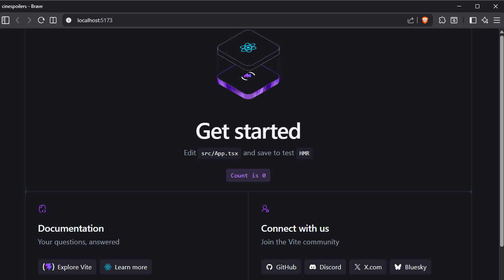

2.- Limpiar Proyecto
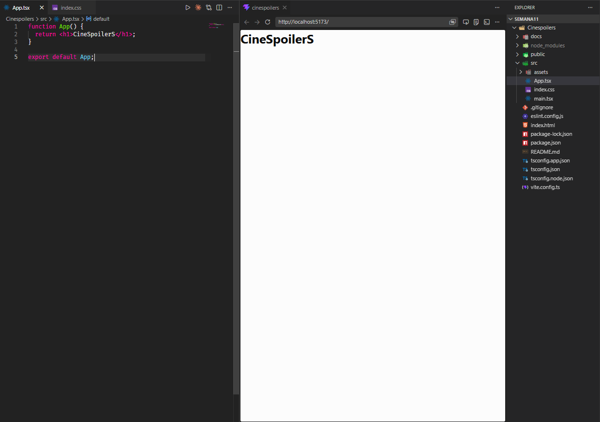

3.- Instalar Tailwind
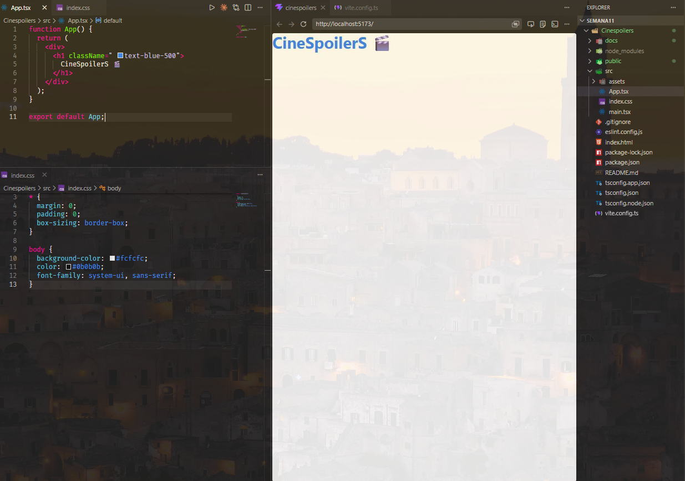

4.- Configurar Alias
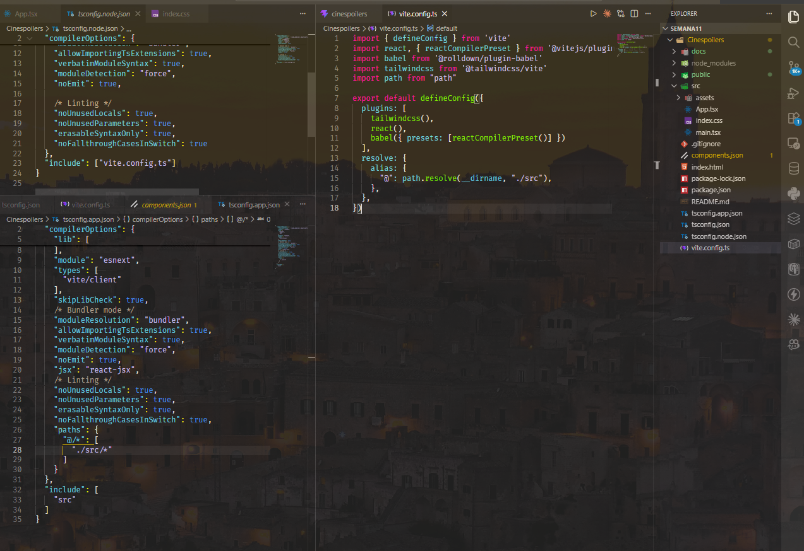

5.- Configurar e Instalar Shadcn
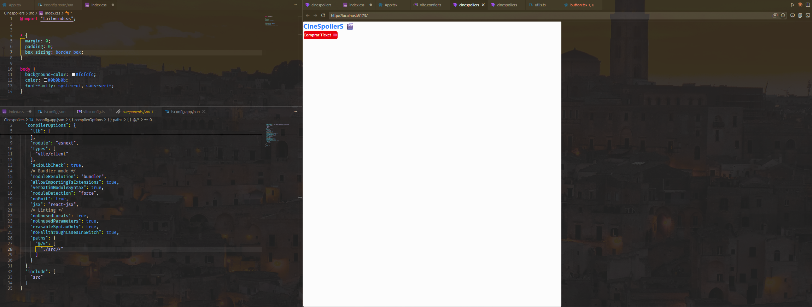

6.- Instalar y configurar axios
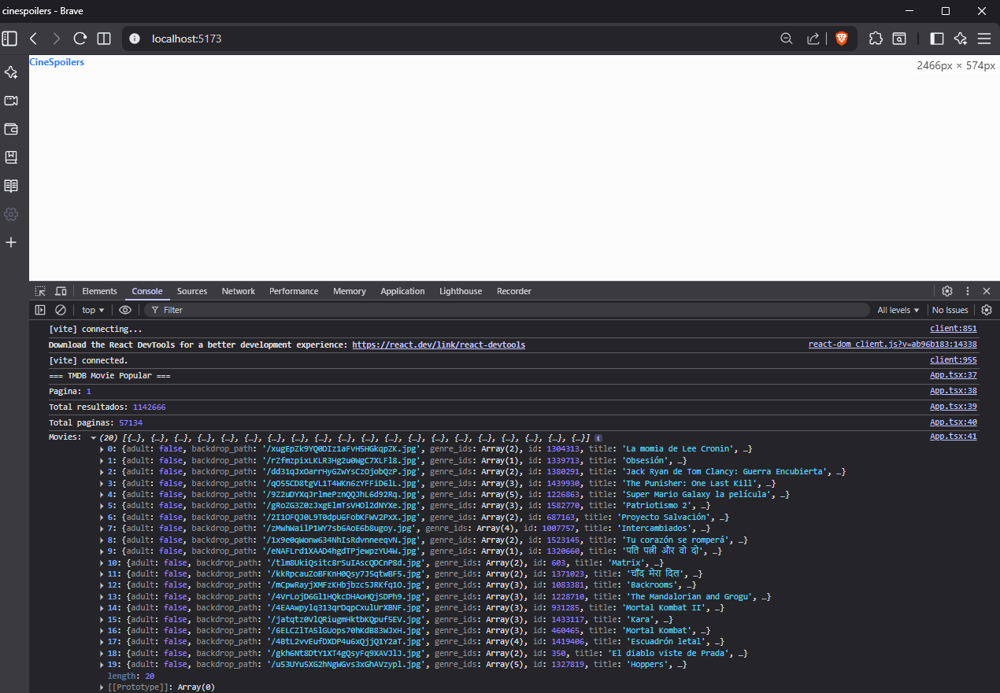

7.- Renderizado de información
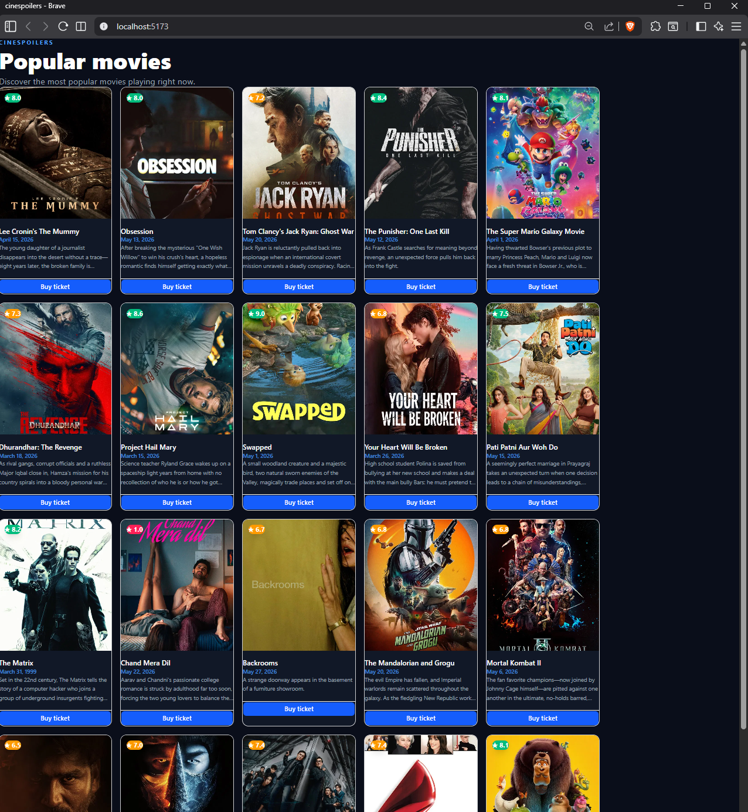
